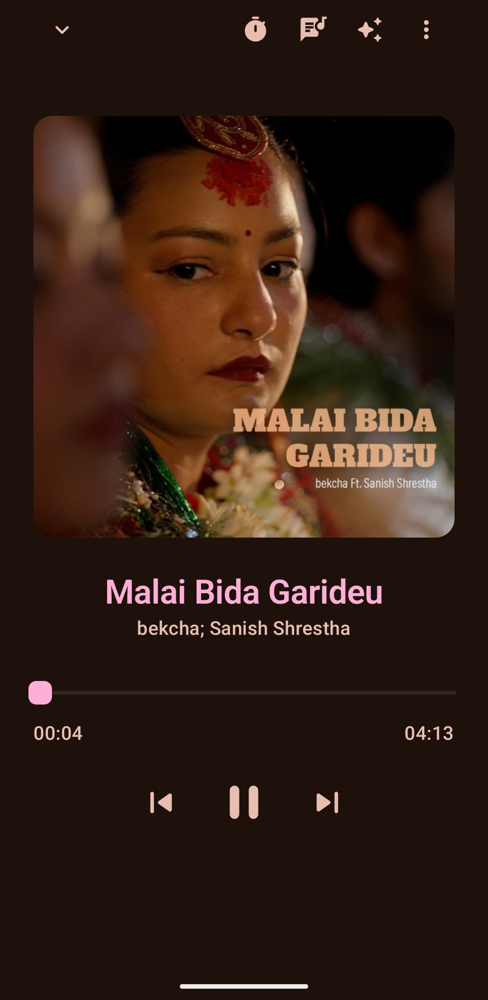
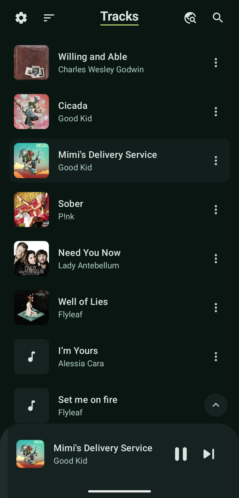

<div align="center">
  

  # Lotus

  ### Music player for Android
  
</div>

Lotus is a clean, offline-first music player with Material You design.
This is a community continuation of [dn0ne's original app](https://github.com/dn0ne/lotus).
I fell in love with Lotus because of what dn0ne built — the design, the
feel, the attention to detail. When upstream development paused, I chose
to maintain it so the app could keep going. All design, branding, and
prior work are theirs. Application ID:
`com.dn0ne.lotus.community`.

## Screenshots

<div align="center">
  <div>
    
    
    
    
    
    
    
    
  </div>
</div>

## Features

- Play MP3, FLAC, OGG, OPUS, WAV, and more
- Browse tracks, albums, artists, genres, and custom playlists
- **Dual shuffle mode** — Pure (unbiased Fisher-Yates) and Smart (penalty-scored artist/album separation)
- **Per-track artwork** — display embedded cover art from individual audio files (opt-in)
- Synchronized lyrics from [LRCLIB](https://lrclib.net/), plus publish your own
- Edit track metadata or fetch it from [MusicBrainz](https://musicbrainz.org/)
- **Global library search** across tracks, albums, artists, genres, and playlists
- **Smart playlists** — Recently Added and Random Mix, auto-generated
- **Export playlists to M3U** for use in other players
- **Backup and restore** — save your playlists and loved tracks to a JSON file
- **Loved tracks** — mark tracks as loved, browse them as a playlist
- **Sleep timer** — presets (15/30/45/60/90 min) with optional finish-current-track
- **Share track** — send any audio file via the Android share sheet
- **Listening stats** — top played, top listened, recently played, per-artist breakdowns
- Material You dynamic color palettes
- **Privacy-first** — network off by default, no telemetry, no analytics, no tracking

## What sets this fork apart

- **Room storage** — migrated from Realm to Android's official Room library, dropping ~10 MB from the APK
- **Dual shuffle mode** — Pure (unbiased Fisher-Yates) and Smart (penalty-scored artist/album separation), all on-device
- **Per-track artwork** — display cover art embedded in individual audio files, with album-art fallback
- **Improved lyrics and metadata** — multi-source fetching from LRCLIB and MusicBrainz, hardened network layer, embedded LRC parsing, plus publish your own lyrics
- **Global library search** — single search field across tracks, albums, artists, genres, and playlists
- **Backup and restore** — export playlists and loved tracks to JSON, restore on any device
- **CI pipeline** — unit tests, linting (detekt + ktlint + Android lint), and signed release builds on every tag
- **Crash logging** — uncaught exceptions written to a private log, shareable from the About page
- **Network hardening** — HTTPS-only, zero redirects without a host allow-list, response size caps
- **Listening stats** — play/skip counts and top charts, with a privacy toggle that stops counting and clears data
- **25+ unit tests** covering shuffle logic, Room migrations, lyrics gating, and backup compatibility

## Smart Shuffle

True randomness clusters — flip a coin enough times and you'll get runs of heads. A pure shuffle does the same thing with artists, and three songs by the same artist in a row feels like the app is broken even though the math is working fine.

Smart Shuffle fixes this by generating five random orders and picking the best one. Each candidate is scored against three criteria: same-artist adjacency (weight 10), same-album adjacency (weight 3, only when artists differ), and position recency (weight 5, decaying toward the end of the queue). The lowest-penalty order wins. Everything runs on-device in under a millisecond with no listening history and no network.

The architecture — generate candidates, score against a quality function, select the best — adapts Monte Carlo sampling methods from computational genomics [1]. Biologists use MCMC to sample valid DNA sequence permutations under evolutionary constraints; Smart Shuffle borrows the pattern but replaces the Markov chain walk with five independent Fisher-Yates draws. The penalty-weighting framework comes from Pauws et al. (2008), who proved playlist sequencing is NP-hard and formalized soft constraint violation as a continuous cost to minimize [2]. Their simulated annealing approach needs hundreds of iterations to converge; Lotus swaps in independent draws because a shuffle button can't pause for half a second while an optimizer warms up.

Three alternative bioinformatics approaches were evaluated and deliberately rejected: Eulerian path shuffling preserves transitions we want to break up, full simulated annealing is too slow for a button tap, and Needleman-Wunsch alignment is a comparison algorithm, not a generation one [3]. Spotify's 2025 "Fewer Repeats" system independently converged on the same architecture [4], but Smart Shuffle arrived at it through the computational biology pathway — constrained to on-device metadata with no profile, no audio features, and no server.

### References

1. Altschul & Erickson, "Significance of nucleotide sequence alignments" (1985), *Mol Biol Evol* 2(6):526–538. Jiang et al., "uShuffle: A useful tool for shuffling biological sequences while preserving the k-let counts" (2008), *BMC Bioinformatics* 9:192.
2. Pauws, Verhaegh & Vossen, "Music playlist generation by adapted simulated annealing" (2008), *Information Sciences* 178(3):647–662.
3. Bountouridis et al., "Melodic Similarity and Applications Using Biologically-Inspired Techniques" (2017), *Applied Sciences* 7(12):1242.
4. Spotify Engineering, "Shuffle: Making Random Feel More Human" (November 2025). https://engineering.atspotify.com/2025/11/shuffle-making-random-feel-more-human

Full version history in [CHANGELOG.md](CHANGELOG.md).

## Download

[](https://f-droid.org/packages/com.dn0ne.lotus.community/)

F-Droid is the recommended channel — auto-updates, signature verification, and no manual APK sideloading.

The original upstream build (different application ID) is also on
[F-Droid](https://f-droid.org/packages/com.dn0ne.lotus) — that is not produced by this fork.

## Support the original author

This fork exists because of [dn0ne](https://github.com/dn0ne)'s work. If
Lotus has been useful to you, consider thanking them on
[Liberapay](https://en.liberapay.com/dn0ne/donate).

## Build

1. Clone the repository:
   ```bash
   git clone https://github.com/Bjorn99/lotus.git
   ```
2. Open the project in Android Studio.
3. Wait for Gradle sync, then click **Run** or press `Shift + F10`.

Release builds are automated via CI — see [docs/RELEASING.md](docs/RELEASING.md)
for the full process.

## Contributing

See [CONTRIBUTING.md](CONTRIBUTING.md) for guidelines on bug reports, feature proposals, and pull requests.

## Credits

Some UI elements inspired by [Vanilla](https://github.com/vanilla-music/vanilla).

Lyrics UI inspired by [Beautiful Lyrics](https://github.com/surfbryce/beautiful-lyrics).

Libraries: [MaterialKolor](https://github.com/jordond/materialkolor), [kmpalette](https://github.com/jordond/kmpalette), [Reorderable](https://github.com/Calvin-LL/Reorderable), [jaudiotagger](https://bitbucket.org/ijabz/jaudiotagger/src/master/).

## License

Lotus is licensed under [GPLv3](LICENSE.md).
