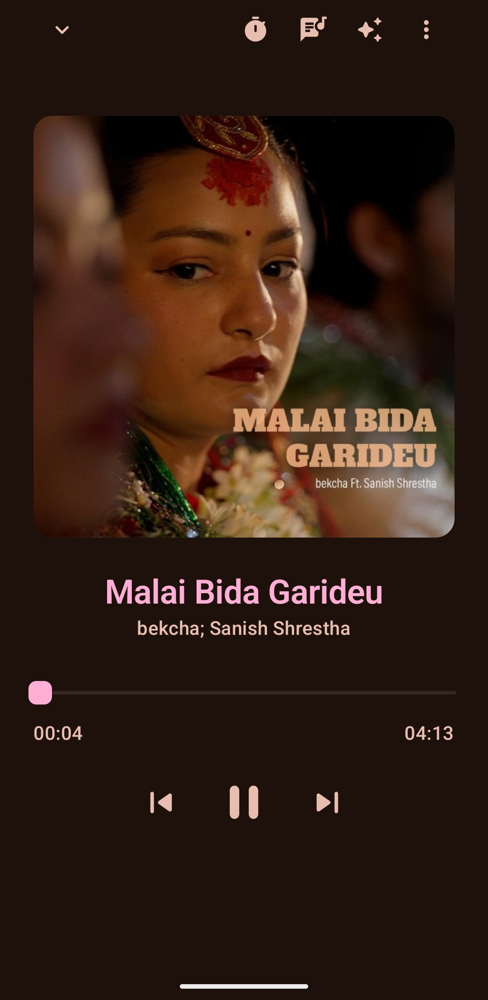
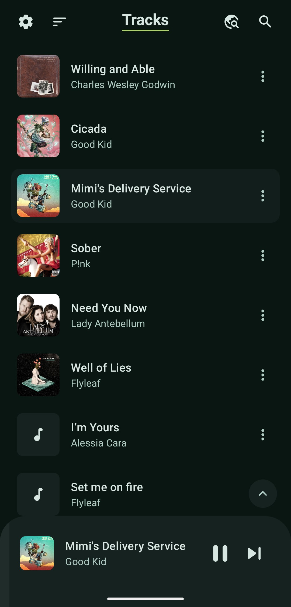

<div align="center">
  

  # Lotus

  ### Music player for Android
  
</div>

Lotus is a clean, offline-first music player with Material You design. This is a community continuation of [dn0ne's original app](https://github.com/dn0ne/lotus).

I fell in love with Lotus because of what dn0ne built — the design, the feel, the attention to detail. When upstream development paused, I chose to maintain it so the app could keep going. All design, branding, and prior work are theirs. Application ID: `com.dn0ne.lotus.community`.

## Screenshots

<div align="center">
  <div>
    
    
    
    
    
    
    
    
  </div>
</div>

## Features

- Play MP3, FLAC, OGG, OPUS, WAV, and more
- Browse tracks, albums, artists, genres, and custom playlists
- **Dual shuffle mode** — Pure (unbiased Fisher-Yates) and Smart (penalty-scored artist/album separation)
- **ReplayGain** — play tracks at a consistent loudness from the ReplayGain tags in your files, by track or by album
- **Per-track artwork** — display embedded cover art from individual audio files (opt-in)
- Synchronized lyrics from [LRCLIB](https://lrclib.net/), plus publish your own
- Edit track metadata or fetch it from [MusicBrainz](https://musicbrainz.org/)
- **Global library search** across tracks, albums, artists, genres, and playlists
- **Smart playlists** — Recently Added and Random Mix, auto-generated
- **Import and export M3U playlists** — compatible with VLC, foobar2000, and other desktop players
- **Backup and restore** — save your playlists and loved tracks to a JSON file
- **Loved tracks** — mark tracks as loved, browse them as a playlist
- **Sleep timer** — presets (15/30/45/60/90 min) with optional finish-current-track
- **Share track** — send any audio file via the Android share sheet
- **Swipe the album art** — drag sideways in the expanded player to change track
- **Listening stats** — top played, top listened, recently played, per-artist breakdowns
- Material You dynamic color palettes
- **Available in English, Turkish, Spanish, Simplified Chinese, Russian, and Ukrainian** — French is in progress
- **Privacy-first** — network off by default, no telemetry, no analytics, no tracking

## What sets this fork apart

- **Room storage** — migrated from Realm to Android's official Room library, dropping ~10 MB from the APK
- **Dual shuffle mode** — Pure (unbiased Fisher-Yates) and Smart (penalty-scored artist/album separation), all on-device
- **ReplayGain** — track and album modes, peak-protected so a boost never clips, with a pre-amp and a separate level for untagged files
- **Per-track artwork** — display cover art embedded in individual audio files, with album-art fallback
- **Improved lyrics and metadata** — multi-source fetching from LRCLIB, MusicBrainz, and sidecar `.lrc` files next to your music; hardened network layer; embedded LRC parsing; plus publish your own lyrics
- **Global library search** — single search field across tracks, albums, artists, genres, and playlists
- **Backup and restore** — export playlists and loved tracks to JSON, restore on any device
- **CI pipeline** — unit tests, linting (detekt + ktlint + Android lint), and signed release builds on every tag
- **Crash logging** — uncaught exceptions written to a private log, shareable from the About page
- **Network hardening** — HTTPS-only, zero redirects without a host allow-list, response size caps
- **Listening stats** — play/skip counts and top charts, with a privacy toggle that stops counting and clears data
- **Swipe to change track** — drag the album art sideways in the expanded player; it runs the same actions as the transport buttons, and mirrors in right-to-left layouts
- **Player performance** — scroll jank eliminated, Inter font subset to Latin-1 for smaller APK, Compose strong skipping via @Stable annotations

## Smart Shuffle

True randomness clusters. Flip a coin enough times and you get runs of heads; a pure shuffle does the same with artists, and three songs by one artist in a row feels broken even though the maths is fine.

So Smart Shuffle builds an order rather than drawing one. It deals tracks out like cards — the artist with the most tracks first, one into every other slot — which forces the most crowded artist as far apart as it can go. Whenever a repeat-free order exists, the deal finds one. A short second pass then makes random swaps and keeps only those that don't make things worse, which breaks up the regularity and also separates albums and anything you just heard. It all runs on-device, with no listening history and no network.

A correction, because you should hear it from us: from 1.5.9 until 1.9.2 the order Smart Shuffle built never reached the player. A bug threw it away, so Pure and Smart both played the same default shuffle. 1.9.2 fixes that, and it's the first release where the behaviour described here actually happens.

Same-artist back-to-backs against a pure shuffle, 500 queues per row:

| Queue | Pure shuffle | Smart Shuffle |
|---|---|---|
| 60 tracks, 6 artists | 8.9 | 0.0 |
| 60 tracks, 3 artists | 19.0 | 0.0 |
| 60 tracks, 2 artists | 28.9 | 0.0 |
| 200 tracks, 12 artists | 15.7 | 0.0 |

The second pass scores the queue as a whole, so on compilation-shaped libraries it can occasionally trade one artist repeat for better album spacing — under 1% of queues when measured, and never more than one repeat.

Treating playlist sequencing as constrained optimisation is well-trodden ground: Pauws, Verhaegh and Vossen model it that way and solve it with adapted simulated annealing [1]. Lotus keeps the weighted cost but reaches the answer by construction rather than by search, which is what lets it land on a good order immediately instead of converging on one while you wait. Bioinformatics sequence shuffling [2] looks adjacent and isn't: it *preserves* local statistics to build null models, where Smart Shuffle exists to break adjacencies up.

### References

1. Pauws, Verhaegh & Vossen, "Music playlist generation by adapted simulated annealing" (2008), *Information Sciences* 178(3):647–662. [doi:10.1016/j.ins.2007.08.019](https://doi.org/10.1016/j.ins.2007.08.019)
2. Altschul & Erickson, "Significance of nucleotide sequence alignments: a method for random sequence permutation that preserves dinucleotide and codon usage" (1985), *Mol Biol Evol* 2(6):526–538. [doi:10.1093/oxfordjournals.molbev.a040370](https://doi.org/10.1093/oxfordjournals.molbev.a040370) — Jiang, Anderson, Gillespie & Mayne, "uShuffle: a useful tool for shuffling biological sequences while preserving the k-let counts" (2008), *BMC Bioinformatics* 9:192. [doi:10.1186/1471-2105-9-192](https://doi.org/10.1186/1471-2105-9-192)

## ReplayGain

ReplayGain evens out loudness between tracks, so a quiet recording and a loud one play at about the same level without you reaching for the volume.

It works from tags already in your files. A scanner program measures each track and each album and writes down how much to turn it up or down to reach a common loudness (−18 LUFS), plus the loudest sample in it, called the peak. Lotus reads those tags and never analyses audio itself, and nothing leaves your phone. The volume change happens inside the audio pipeline exactly where one track ends and the next begins, so gapless albums stay gapless.

Turn it on in **Settings → Playback → ReplayGain**. It's off by default.

**Track** brings every song to the same loudness. Use it for shuffle and mixed playlists, where a quiet acoustic song can follow a loud rock track.

**Album** moves a whole album up or down by one amount. The album as a whole matches your other music, but its own shape survives: a soft ballad stays softer than the song before it, the way the artist mastered it. Use it when you listen to albums from start to finish. If a file only carries one of the two values, Lotus uses the one it has.

**Pre-amp** (−15 to +15 dB) shifts every tagged track by the same amount. Because ReplayGain aims every track at −18 LUFS, turning it on can make your music quieter overall; the pre-amp brings it back up. Tracks stay evened out against each other.

**Untagged tracks** (−15 to 0 dB) sets the level for files with no ReplayGain tags. Most tagged tracks get turned down, so an untagged file played as-is would stand out as the loudest thing in the room. Lower this until untagged files blend in; around −6 dB is a reasonable place to start. The pre-amp doesn't apply to these files.

Turning a quiet track up can push its loudest moments past what the audio can hold, which distorts it. Lotus uses the peak tag to stop any boost at the point where the loudest sample just reaches full scale. A file without a peak tag is only ever turned down, never up. Opus files tagged the R128 way carry no peak, so they fall in that group; Opus files tagged by rsgain's default mode carry normal peak tags and are treated like FLAC.

### Getting it set up

1. Tag your library once. [rsgain](https://github.com/complexlogic/rsgain) is a good choice: `rsgain easy /path/to/music` writes track and album values and peaks at −18 LUFS.
2. Put the files on your phone as usual and let Android pick up the changes.
3. Choose Track or Album, set the pre-amp to taste, and set the untagged level so untagged files blend in.

If you retag files later, Lotus notices the change and reads them again, with no restart.

Lotus reads ReplayGain from FLAC, MP3, M4A and Opus files. Formats it can't read tags from (such as `.aac`, `.wv` and `.ape`) count as untagged. APEv2 tags in MP3 files and iTunes Sound Check aren't read. The first time a very large file plays, Lotus may not have read its tags before it starts, so that one play can begin at normal volume; every play after that is corrected.

## Download

[](https://f-droid.org/packages/com.dn0ne.lotus.community/)

F-Droid is the recommended channel — auto-updates, signature verification, and no manual APK sideloading. Tagged releases are also on the [releases page](https://github.com/Bjorn99/lotus/releases); if you sideload, take `universal` unless you know your device's architecture, and check the download against `SHA256SUMS.txt`.

The original upstream build (different application ID) is also on [F-Droid](https://f-droid.org/packages/com.dn0ne.lotus) — that one is not produced by this fork.

Full version history is in [CHANGELOG.md](CHANGELOG.md).

## Support the original author

This fork exists because of [dn0ne](https://github.com/dn0ne)'s work. If Lotus has been useful to you, consider thanking them on [Liberapay](https://en.liberapay.com/dn0ne/donate).

## Build

1. Clone the repository:
   ```bash
   git clone https://github.com/Bjorn99/lotus.git
   ```
2. Open the project in Android Studio.
3. Wait for Gradle sync, then click **Run** or press `Shift + F10`.

Release builds are automated via CI — see [docs/RELEASING.md](docs/RELEASING.md) for the full process.

## Contributors

Lotus is kept going by people who file good bug reports, translate it, and send patches. Thank you.

- **[@uhrfra](https://github.com/uhrfra)** — relative-path support in M3U playlist import, based on their [#73](https://github.com/Bjorn99/lotus/pull/73) and shipped in v1.8.0; on-device testing of the v1.8.2 fixes
- **[@bxdxnn](https://github.com/bxdxnn)** — media notification icon ([#118](https://github.com/Bjorn99/lotus/pull/118)), the track menu in global search ([#131](https://github.com/Bjorn99/lotus/pull/131)), and swipe-to-change-track ([#128](https://github.com/Bjorn99/lotus/pull/128))
- **[@valenzit0](https://github.com/valenzit0)** — Spanish translation ([#138](https://github.com/Bjorn99/lotus/issues/138))
- **[@MCfool](https://github.com/MCfool)** — Simplified Chinese translation ([#143](https://github.com/Bjorn99/lotus/issues/143))
- **[@KerimDemirkaynak](https://github.com/KerimDemirkaynak)** — Turkish translation ([#149](https://github.com/Bjorn99/lotus/pull/149))
- **Mickaël Binos** — French translation

## Translations

[](https://hosted.weblate.org/engage/lotus/)

Lotus is translated on [Weblate](https://weblate.org/), which hosts the project free of charge under its libre plan. You don't need a GitHub account or Android tooling to help — pick a language at [hosted.weblate.org/engage/lotus](https://hosted.weblate.org/engage/lotus/) and start translating; Weblate opens the pull request itself and your name goes on the commits.

New languages are welcome. See [CONTRIBUTING.md](CONTRIBUTING.md#translations) for the details, including how to send a translation as a plain pull request if you'd rather not use Weblate.

Weblate takes [donations](https://weblate.org/donate/) if you'd like to help them keep doing this for libre projects.

## Contributing

Bug reports, feature proposals, and pull requests are all welcome. [CONTRIBUTING.md](CONTRIBUTING.md) covers the workflow and what makes a report easy to act on.

## Credits

Lotus was created by [dn0ne](https://github.com/dn0ne). This fork carries their design and branding forward.

Some UI elements inspired by [Vanilla](https://github.com/vanilla-music/vanilla). Lyrics UI inspired by [Beautiful Lyrics](https://github.com/surfbryce/beautiful-lyrics).

Libraries: [MaterialKolor](https://github.com/jordond/materialkolor), [kmpalette](https://github.com/jordond/kmpalette), [Reorderable](https://github.com/Calvin-LL/Reorderable), [jaudiotagger](https://bitbucket.org/ijabz/jaudiotagger/src/master/).

Translation hosting provided free of charge by [Weblate](https://weblate.org/) under their Libre plan.

## License

Lotus is licensed under [GPLv3](LICENSE.md).
